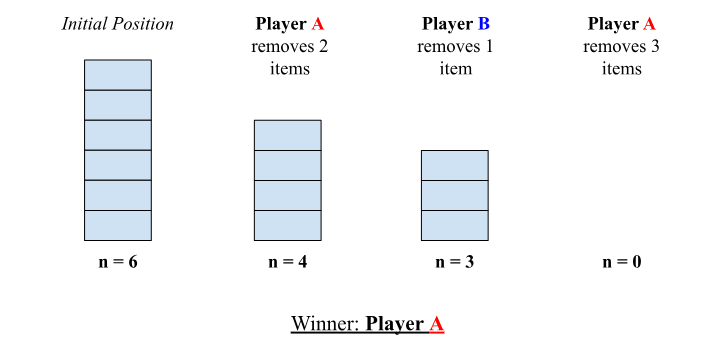
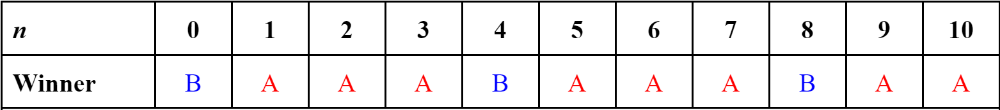

# Nim Project

## What is Nim?

Nim is an impartial, combinatorial game where players take turns removing (or "nimming") objects from a heap or heaps of objects. In a game of traditional Nim played with *n* objects, players can remove anywhere from 1 to *n* objects on their turn, and the player to remove the last object wins (or, the player that cannot remove any objects loses).

Rather than removing any number of objects, there are also variations of the game where only a specific number of objects can be removed on a turn - we'll call this a moveset restriction. Thus, `Nim(1, x, y)` represents a nim game with a moveset restriction of 1, *x* and *y* (players are allowed to remove exactly 1, *x*, or *y* objects on their turn); for this project, `Nim(1, 2, 3)` games will be analyzed. In addition, single-heap games (games with one heap) will be studied, rather than those with multiple.

## Win Tables

  

*
Figure 1. A sample single-heap game of Nim(1, 2, 3) with 6 objects
*
  

In the figure above, Player A wins because Player B cannot remove any objects on its last turn (can you take away from 0 objects?). As a matter of fact, Player A will always win no matter what, if he/she plays perfectly. 

You can try it out yourself: if Player A removes 2 objects on their first turn, can Player B win? If Player B removes 1 object, Player A can just remove 3 and win; if they remove 2, then Player A can do the same and win; if Player B removes 3, then Player A just simply removes 1 and wins. As seen here, as long as Player A removes 2 objects on their first turn, they will **always** win, no matter what.

This principle extends to the same game with sizes - with 7 objects, Player A always wins; with 8 objects, it's Player B; with 9, it's back to Player A, and so on. You could go on and on with this forever; what's interesting, however, is when you write it all down. 

  

*
Figure 2. Win-table for single-heap nim game with moveset Nim(1, 2, 3)
*
  

